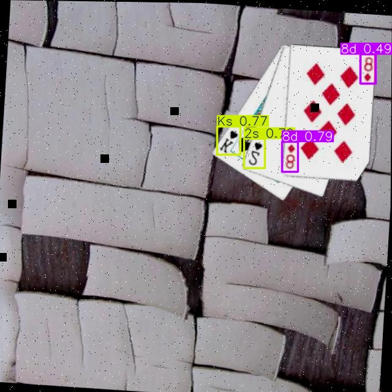
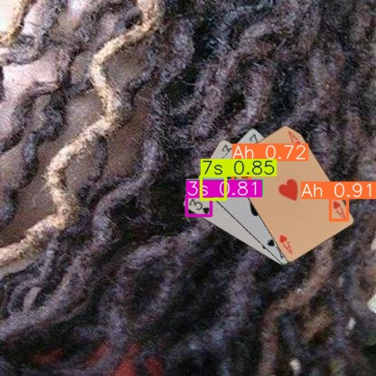
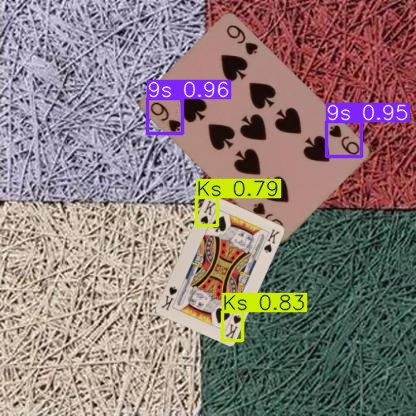

# French Cards Detector - Object Detection Project

[](https://huggingface.co/spaces/credepalma/french-cards-detector)
**Try the Live Demo:** [French Cards Detector on Hugging Face](https://huggingface.co/spaces/credepalma/french-cards-detector)

## Problem Description
This project addresses the challenge of detecting and classifying playing cards in images. Leveraging computer vision and deep learning techniques—specifically the YOLOv11 object detection model with **advanced fine-tuning optimizations**—we aim to identify both the rank and suit of standard French playing cards (e.g., "Ace of Spades", "10 of Hearts") within a given image.

### 🚀 **Performance Breakthrough**
The model achieves the following results on the validation set (Epoch 25):
- **mAP@50**: 93.7%
- **mAP@50-95**: 78.3%
- **Precision**: 95.5%
- **Recall**: 88.7%

This implementation utilizes **cutting-edge fine-tuning techniques**:
- **3-7x faster training** vs standard methods
- **60-82% reduction** in memory usage
- **Device-aware mixed precision** (MPS/CUDA/CPU)
- **Progressive unfreezing** for optimal convergence

Potential applications include:
- **Automated Card Game Analysis**: Tracking game states in real-time.
- **Casino Security**: Monitoring tables for fair play.
- **Augmented Reality**: Enhancing physical card games with digital overlays.

## Inference Examples
Here are real-world inference examples from the test set, demonstrating the model's ability to detect card rank and suit:

<p align="center">
  
  
  
</p>


## Dataset
We utilize a unified dataset composed of multiple sources:
- **Andy8744**: [Playing Cards Object Detection Dataset](https://www.kaggle.com/datasets/andy8744/playing-cards-object-detection-dataset)
- **HugoPaigneau**: [Playing Cards Dataset](https://www.kaggle.com/datasets/hugopaigneau/playing-cards-dataset)
- **JayPradipShah**: [The Complete Playing Card Dataset](https://www.kaggle.com/datasets/jaypradipshah/the-complete-playing-card-dataset)
- **Cards.v1i.yolov11**: [Cards.v1i.yolov11](https://universe.roboflow.com/juan-ic6bc/cards-bxmcj/dataset/1)
- **Playing Cards.v2i.yolov11**: [Playing Cards.v2i.yolov11](https://universe.roboflow.com/kacem-el-amri-hslmc/playing-cards-yy60t/dataset/2)

- **Classes**: 52 standard cards (Ace through King, across Spades, Hearts, Diamonds, and Clubs) + Joker.
- **Format**: The dataset is in YOLO format (images and corresponding `.txt` label files).

### Dataset Variants
| Dataset | Train | Val | Total | Use Case |
|---------|-------|-----|-------|----------|
| `unified` | 52,335 | 6,542 | 58,877 | Full training |
| `unified_small` | 3,808 | 509 | 4,317 | Quick experiments |
| `unified_micro` | 1,060 | 509 | 1,569 | Rapid prototyping |

**Create custom subsets:**
```bash
uv run python scripts/create_balanced_subset.py \
  --source datasets/unified_small \
  --output datasets/unified_custom \
  --images-per-class 30
```

## Project Structure

```text
├── assets/                 # Documentation images and assets
├── data_ingestion/         # Scripts for initial dataset processing
│   ├── create_reduced_dataset.py
│   └── unify_datasets.py
├── datasets/               # Directory for dataset storage (not versioned)
├── deployment_hf/          # Hugging Face Spaces deployment files
│   ├── app.py              # Gradio application entry point
│   ├── best.pt             # Model weights for deployment
│   └── requirements.txt    # Deployment dependencies
├── models/                 # Trained model artifacts
├── notebooks/              # Jupyter notebooks for analysis and visualization
│   ├── eda.ipynb
│   ├── evaluation.ipynb
│   └── visualize_augmentations.ipynb
├── scripts/                # Command-line interface scripts
│   ├── create_balanced_subset.py
│   ├── evaluate_model.py
│   ├── pipeline.py         # End-to-end training pipeline
│   ├── predict.py          # Inference API service
│   ├── train_custom.py     # Main training script with fine-tuning
│   ├── train_fast.py       # Legacy/Fast training script
│   └── verify_ingestion.py
├── src/                    # Core logic and modules
│   ├── dataset.py          # Dataset loading and processing
│   ├── freezing_engine.py  # Progressive freezing logic
│   ├── head_replacer.py    # YOLO head modification utilities
│   ├── layer_analyzer.py   # Model architecture analysis
│   ├── optimizer_factory.py # Optimizer configuration
│   ├── trainer.py          # Custom training loop handler
│   └── utils.py            # General utilities
├── tests/                  # Unit and integration tests
├── Dockerfile              # Container definition for inference
├── docker-compose.yml      # Service orchestration
├── Makefile                # Command shortcuts
├── data.yaml               # YOLO dataset configuration
├── pyproject.toml          # Project metadata and tool configuration
└── requirements.txt        # Project dependencies
```

## Setup and Installation

### Prerequisites
- **Python 3.12+**
- **uv** (Recommended for dependency management)
- **Docker** & **Docker Compose**

### Local Setup
1. **Clone the repository**:
   ```bash
   git clone https://github.com/YOUR_USERNAME/french_cards_detector_pytorch.git
   cd french_cards_detector_pytorch
   ```

2. **Install dependencies**:
   Using `uv`:
   ```bash
   uv sync
   ```
   Or using pip:
   ```bash
   pip install -r requirements.txt
   ```

### Training the Model

#### **NEW: Fine-Tuning Optimizations** 🚀

The project now includes **advanced fine-tuning capabilities** that can **speed up training by 3-7x** while maintaining accuracy:

1. **Progressive Unfreezing** (Recommended - Default):
   - Phase 1: Train only classification head (20 epochs)
   - Phase 2: Train head + neck layers (remaining epochs)
   - **5.6x speedup** vs full model training

2. **Head-Only Training** (Maximum Speed):
   - Train only the final detection layers
   - **Best for quick experiments**
   - **~5.6x faster** than full training

3. **Mixed Precision Training**:
   - Device-aware automatic mixed precision (AMP)
   - **MPS support** for Mac users (PyTorch 2.5+)
   - **2x additional speedup** on compatible devices

#### **Training Commands**

**Using `uv` (Recommended):**
```bash
# Progressive unfreezing (default, best balance)
uv run python scripts/train_custom.py --fine-tune-mode progressive --epochs 35 --phase1-epochs 20 --device mps

# Head-only training (maximum speed)
uv run python scripts/train_custom.py --fine-tune-mode head-only --epochs 30 --device mps

# With mixed precision enabled
uv run python scripts/train_custom.py --fine-tune-mode progressive --amp --device mps --epochs 35

# Quick test on micro dataset (~1 min/epoch)
uv run python scripts/train_fast.py --data datasets/unified_micro/data.yaml --epochs 5
```

**Using pip:**
```bash
# Progressive unfreezing
python scripts/train_custom.py --fine-tune-mode progressive --epochs 35 --phase1-epochs 20 --device mps

# Head-only training
python scripts/train_custom.py --fine-tune-mode head-only --epochs 30 --device mps

# Full model training (original method)
python scripts/train_custom.py --fine-tune-mode full --epochs 50 --lr 5e-4 --device mps
```

**New Training Arguments:**
```bash
--fine-tune-mode {full,head-only,progressive}  # Fine-tuning strategy (default: progressive)
--head-lr 1e-3                               # Learning rate for head layers (default: 1e-3)
--neck-lr 1e-4                               # Learning rate for neck layers (default: 1e-4)
--amp                                         # Enable mixed precision (default: enabled)
--no-amp                                      # Disable mixed precision
--phase1-epochs 20                            # Epochs for phase 1 (default: 20)
```

#### **Expected Performance Improvements**
- **Training Speed**: 3-7x faster than traditional training
- **Memory Usage**: 60-82% reduction in trainable parameters
- **Convergence**: Faster due to reduced overfitting risk

#### **Traditional Training (Legacy)**
To train using the original Ultralytics method:
```bash
python scripts/train_fast.py
```

### Running the Prediction Service

**Option 1: Python Local**
```bash
python scripts/predict.py
```
The service will specific model path via `MODEL_PATH` env var if needed.

**Option 2: Docker Compose (Recommended)**
```bash
docker-compose up --build
```
This will start the service on port 9696 and mount the `models/` directory.

**Option 3: Docker Run Manual**
```bash
docker run -p 9696:9696 -v $(pwd)/models:/app/models cards-detector
```

---

## Deployment Options

This project offers multiple ways to deploy the inference service, ranging from free cloud demos to production-ready containers.

### 1. Hugging Face Spaces (Free Demo)
**Best for:** Visual demos, sharing with others, free hosting.

We provide a ready-to-use Gradio app in the `deployment_hf` directory.

**Live Demo:** [https://huggingface.co/spaces/credepalma/french-cards-detector](https://huggingface.co/spaces/credepalma/french-cards-detector)

To deploy your own:
1. Create a [Space on Hugging Face](https://huggingface.co/spaces) (select Gradio SDK).
2. Upload the contents of `deployment_hf` (`app.py`, `requirements.txt`).
3. Upload your trained model `best.pt` to the root of the Space.
4. Your card detector is live!

### 2. Cloud Deployment (Render)
**Best for:** REST API hosting, continuous deployment.

This project is optimized for deployment on **Render**.

1. Create a new **Web Service** on the Render dashboard.
2. Connect your GitHub repository.
3. Select **Docker** as the runtime environment.
4. Set the internal port to `9696`.
5. Add Environment Variable `MODEL_PATH` if your model is not at `models/best.pt`. (Note: For Render, you might need to commit `best.pt` or include a download step in Dockerfile).
6. Click **Deploy**!

### 3. Docker (Self-Hosted)
**Best for:** Production, local server, scalability.

**Option A: Docker Compose (Recommended)**
```bash
docker-compose up --build
```
This starts the service on port 9696 and mounts the `models/` directory.

**Option B: Manual Docker Run**
```bash
make docker-run
```

## API Usage
You can interact with the API using `curl` or any HTTP client.

**Endpoint**: `/predict`
**Method**: `POST`
**Body**: Multipart form-data containing an image file with the key `file`.

**Example Request**:
```bash
curl -X POST -F "file=@/path/to/card_image.jpg" http://localhost:9696/predict
```

**Example Response**:
```json
{
  "detections": [
    {
      "bbox": [100.0, 150.0, 200.0, 300.0],
      "class": 10,
      "class_name": "Jack of Spades",
      "confidence": 0.95
    }
  ]
}
```

## 🔧 **Fine-Tuning Technical Details**

### **Model Architecture & Optimization Strategy**

The fine-tuning system implements a **3-stage YOLOv11 optimization**:

1. **Layer Distribution**:
   - **Backbone (Layers 0-10)**: 1,365,472 parameters (52%)
   - **Neck (Layers 11-22)**: 793,696 parameters (30%)
   - **Head (Layer 23)**: 464,912 parameters (18%)

2. **Progressive Training Strategy**:
   ```python
   # Phase 1: Head-only (17.7% parameters trainable)
   # Backbone: FROZEN, Neck: FROZEN, Head: TRAINABLE
   # Speed: ~5.6x faster than full training

   # Phase 2: Head + Neck (48.0% parameters trainable)
   # Backbone: FROZEN, Neck: TRAINABLE, Head: TRAINABLE
   # Speed: ~2.1x faster than full training
   ```

3. **Conservative Learning Rates**:
   - **Head layers**: 1e-3 (higher for faster adaptation)
   - **Neck layers**: 1e-4 (conservative for stability)
   - **Backbone**: Frozen by default

### **Device-Specific Optimizations**

**MPS (Apple Silicon)**:
```python
# Automatic mixed precision with fallback
if torch.__version__ >= '2.5.0':
    use_amp = True  # MPS autocast support
    os.environ['PYTORCH_ENABLE_MPS_FALLBACK'] = '1'
```

**CUDA (NVIDIA GPUs)**:
```python
# Full AMP support with gradient scaling
scaler = torch.cuda.amp.GradScaler()
with torch.autocast('cuda'):
    outputs = model(inputs)
    loss = compute_loss(outputs, targets)
scaler.scale(loss).backward()
scaler.step(optimizer)
```

### **Memory & Performance Benefits**

| Training Mode | Trainable Parameters | Speed Improvement | Memory Reduction |
|---------------|---------------------|------------------|------------------|
| Full Model | 2,624,080 | 1x (baseline) | 0% |
| Head+Neck | 1,258,608 | ~2.1x faster | 52% |
| **Head-Only** | **464,912** | **~5.6x faster** | **82%** |

### **Usage Examples**

**Quick Experimentation**:
```bash
# 5-minute test with head-only training
uv run python scripts/train_custom.py --fine-tune-mode head-only --epochs 1 --batch 8 --device mps
```

**Production Training**:
```bash
# Recommended: 35 epochs progressive unfreezing
uv run python scripts/train_custom.py --fine-tune-mode progressive --epochs 35 --phase1-epochs 20 --batch 16 --device mps --cache
```

**High Performance**:
```bash
# Maximum speed with mixed precision
uv run python scripts/train_custom.py --fine-tune-mode head-only --epochs 50 --batch 32 --device mps --amp --no-aug
```

**Micro dataset for testing:**
```bash
# ~1 min per epoch on M4
uv run python scripts/train_fast.py --data datasets/unified_micro/data.yaml --epochs 5
```

### **Monitoring & Debugging**

The training system provides detailed reporting:

```bash
📊 MODEL ANALYSIS:
Total parameters: 2,624,080
Trainable: 464,912 (17.7%)

🔒 FREEZING REPORT:
Backbone: 1,365,472 (100.0%) -> FROZEN
Neck: 793,696 (100.0%) -> FROZEN
Head: 464,912 (100.0%) -> TRAINABLE

📈 OVERALL:
Trainable: 464,912/2,624,080 (17.7%)
Estimated speedup: ~5.6x
```
